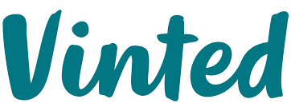
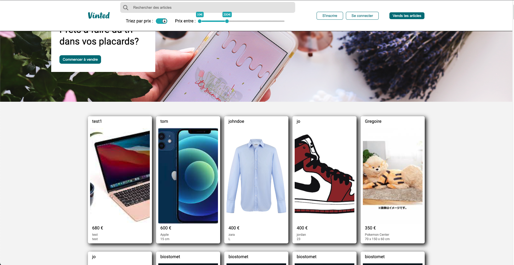
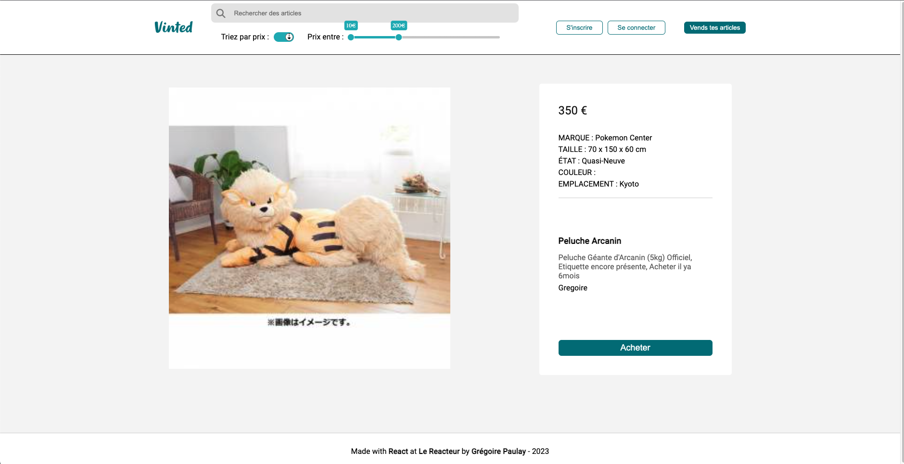
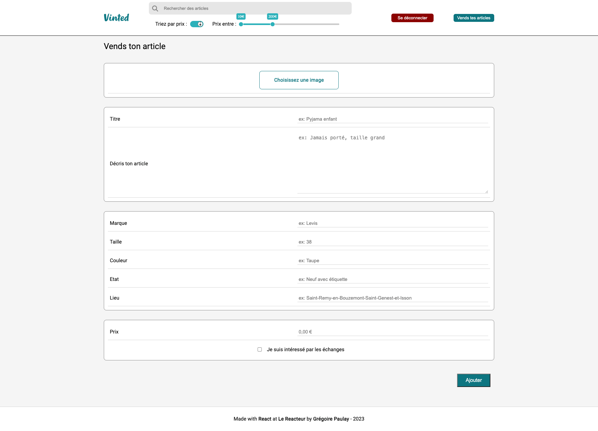

# Vinted React

<h2 align="center">

</h2>

## Overview

**A clone of the Vinted Site.** This is the Front-end part of full-stack project, you can find my Back-end for this project <a font-weight="bold" href="https://github.com/Gregoire-Paulay/Vinted-BackEnd">here</a>
6 pages are avialables: Home (See all offers available), Offer (Details on a specific Offer), Login (Connect with an existing account), SignUp (Create an account), Payment (Pay an Offer), Publish (Publish an Offer, need to be logged).
On the Hompage you will find differents filters to sort all available Offers and a functional searchbar.

## Screenshots

<div align="center">





</div>

### Running the project

Clone this repository :

```
git clone :https://github.com/Gregoire-Paulay/Vinted-Front.git
cd Vinted-Front
```

Install Packages :

```
yarn
```

When installation is complete, you have to launch :

```
yarn dev
```

Once the server is running use : **cmd + click** on the link in your terminal to open it in your browser

## Star, Fork, Clone & Contribute

Feel free to contribute on this repository. If my work helps you, please give me back with a star. This means a lot to me and keeps me going!
